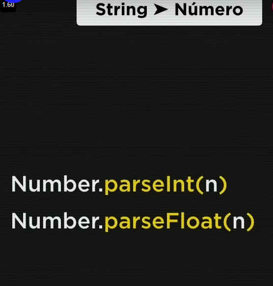
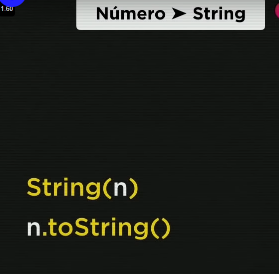

Variaveis JavaScrip

    // como fazer um comentario 

    //identificadores

    //Dicas para variaveis
    

    //Tipos primitivos primordiais
    

    
    String
    Number
    boolean

    //Outros tipos de data

    //Descobrir o tipo de dado
    
 

    //Exemplos o tipo de dado
    

    // window.prompt sempre retorna uma string
        então uma necessidade de conversao de dados 

 .png)   

    //Conversao de dados String > Number
    
        

    //Conversao de dados Number > String
    
